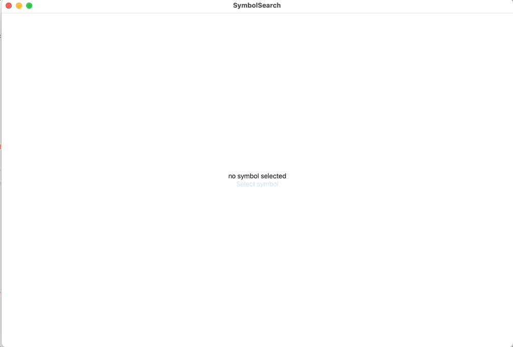

# Project for the 17 Sept 2022 A Flock of Swifts Meetup

This project demostrates using the [optimized version of the Levenstien distance](https://www.baeldung.com/cs/levenshtein-distance-computation) to perform fuzzy search on SF Symbols for macOS.

